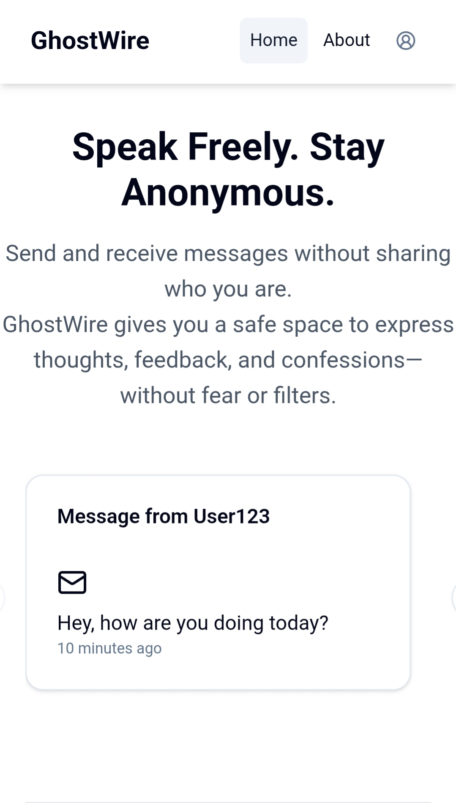
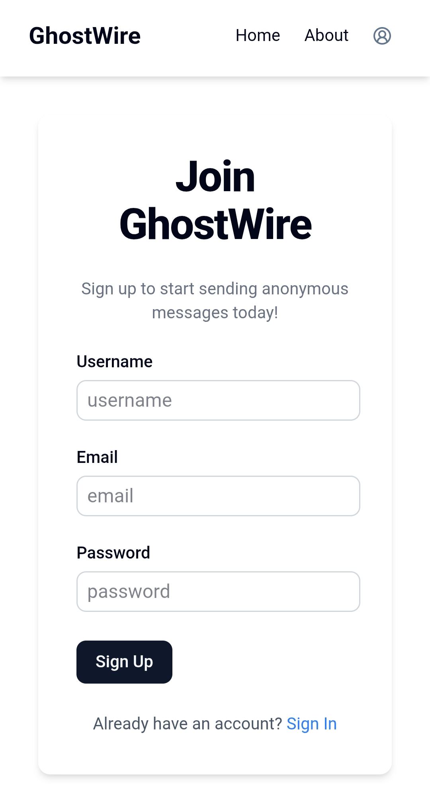
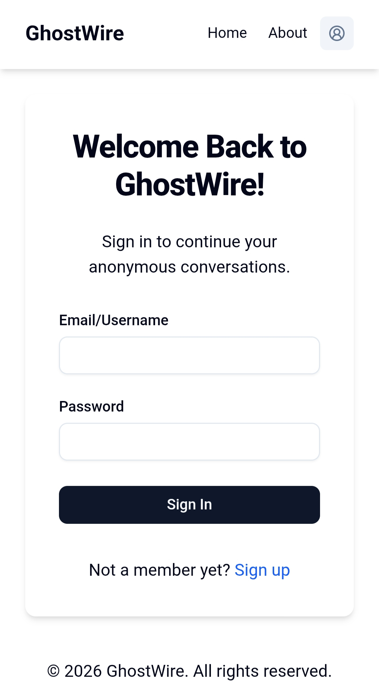
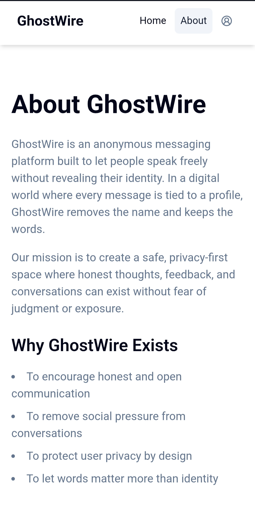
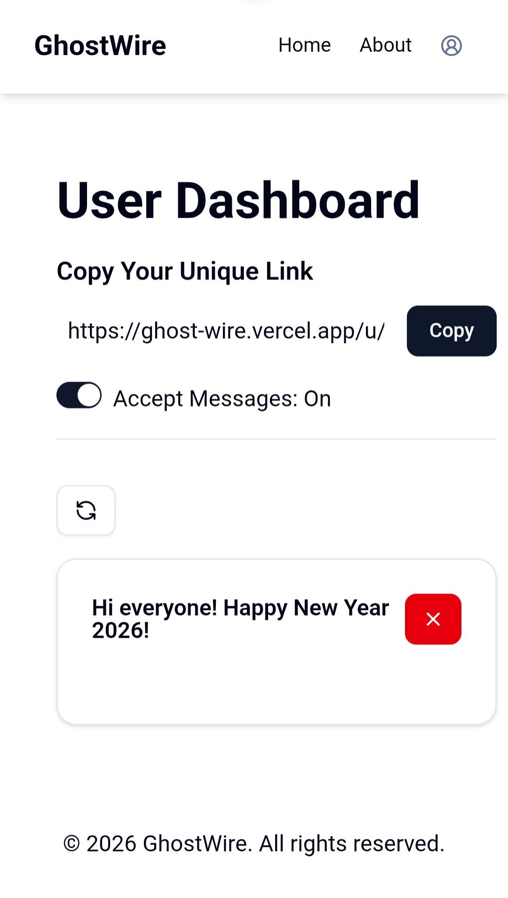

# 👻 GhostWire – An Anonymous Messenger App

GhostWire is a **full-stack anonymous messaging web application** that allows users to send and receive messages without revealing their identity.  
It is designed with a **privacy-first approach**, modern UI, secure authentication, and **AI-powered message suggestions**.

This project is built to showcase **real-world Next.js full-stack development skills** for internships and junior developer roles.

---

## 🌐 Live Demo

🔗 **Live URL:** https://ghost-wire.vercel.app  

🔗 **Anonymous Message Link Format:**
- URL: https://ghost-wire.vercel.app/u/{username}
- Anyone with your link can send you anonymous messages — no login required.

---

## ✨ Features

- 🔒 Anonymous messaging (no sender identity stored)
- 🔗 Shareable public profile link
- 🤖 AI-powered message suggestions
- 🔐 Secure authentication using NextAuth
- 📬 Email notifications for new messages
- 🌗 Light / Dark theme support
- 📊 User dashboard for message management
- 🛡️ Toggle message acceptance (privacy control)
- 📱 Fully responsive UI

---

## 🖼️ Screenshots

### Home Page


### Sign Up Page


### Sign In Page


### About Page


### Anonymous Message Card


### User Dashboard


---

## 🛠️ Tech Stack

### Frontend
- Next.js 16 (App Router)
- React 19
- TypeScript
- Tailwind CSS v4
- Radix UI
- Lucide Icons
- Sonner (toast notifications)

### Backend
- Next.js API Routes
- MongoDB
- Mongoose
- NextAuth.js
- bcryptjs (password hashing)

### AI & Utilities
- AI SDK (`ai`)
- `@ai-sdk/openai`
- `@ai-sdk/react`
- Zod (schema validation)
- React Hook Form
- Axios
- Resend (email service)

---

## 📂 Project Structure (Simplified)
```file-structure
ghostwire/
├── emails/ # Email templates
├── screenshots/ # README screenshots
├── src/
│ ├── app/ # Next.js App Router
│ │ ├── (app)/ # Protected application routes
│ │ │ └── dashboard/ # User dashboard
│ │ ├── (auth)/ # Authentication routes
│ │ │ ├── sign-in/
│ │ │ ├── sign-up/
│ │ │ └── verify/
│ │ ├── api/ # Backend API routes
│ │ ├── about/ # Static pages
│ │ ├── u/[username]/ # Public anonymous message page
│ │ ├── layout.tsx
│ │ └── page.tsx
│ ├── components/ # Reusable UI components
│ ├── hooks/ # Custom React hooks
│ ├── helpers/ # Helper functions
│ ├── lib/ # Database & utility logic
│ ├── models/ # Mongoose schemas
│ ├── schemas/ # Zod validation schemas
│ └── types/ # TypeScript types
├── package.json
└── README.md

```
---

## ⚙️ Installation & Setup

### 1️⃣ Clone the Repository
```bash
git clone https://github.com/your-username/ghostwire.git
cd ghostwire
```
### 2️⃣ Install Dependencies 
```bash
pnpm install
```

### 3️⃣ Environment Variables
```.env
MONGODB_URI=your_mongodb_connection_string
NEXTAUTH_SECRET=your_nextauth_secret
NEXTAUTH_URL=http://localhost:3000

OPENAI_API_KEY=your_openai_api_key
RESEND_API_KEY=your_resend_api_key
EMAIL_FROM=no-reply@ghostwire.com
```

### 4️⃣ Run the Development Server
```bash
pnpm dev
```
Open http://localhost:3000 in your browser.

---

## 🤖 AI Message Suggestions

GhostWire uses the AI SDK to generate helpful and friendly anonymous message suggestions.
All AI logic runs on server-side API routes, ensuring API keys remain secure.

---

## 🔐 Authentication & Security

- Session-based authentication with NextAuth.js
- Passwords hashed using bcryptjs
- Protected dashboard routes
- No sender identity stored for anonymous messages

---

## 🎯 Why GhostWire?

GhostWire is built for people who want to express thoughts, feedback, or confessions freely — without social pressure.
It prioritizes privacy, simplicity, and honest communication.

---

## 📈 Future Improvements

- Spam and abuse protection
- Rate limiting
- Message analytics
- Profile customization
- Progressive Web App (PWA) support

---

## 👨‍💻 Author

Guddu Kumar

MERN Stack Developer | Next.js Developer | Software Enthusiast

Focused on building secure, scalable, and modern web applications.
